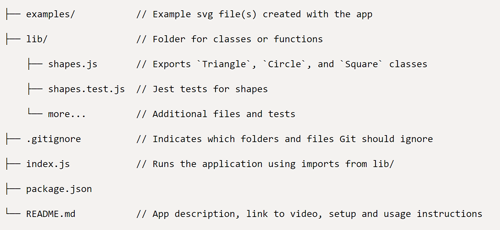

# SVG Logo Generator <!-- omit from toc -->
by Sheila Hanson 

## Description <!-- omit from toc -->
- This is a Node.js command-line application that takes in user input to generate a logo and save it as an SVG file.  
- The purpose is to generate a simple logo for my projects so that I don't have to pay a graphic designer.  
- Node.js with the Inquirer (collecting user input) and Jest (running tests) packages will assist in making the function of this application come to life.  
  - There will be a series of prompts to assist with building your logo.  
  - Once your prompts are finished you will be able to see the SVG image in a browser.

## Table of Contents <!-- omit from toc -->
  
- [Installation](#installation)
  - [User Story](#user-story)
  - [Acceptance Criteria](#acceptance-criteria)
  - [Wireframe](#wireframe)
- [Usage](#usage)
- [Features](#features)
- [Challenges](#challenges)
- [Contributing](#contributing)
- [License](#license)
- [Testing](#testing)
- [Questions](#questions)
- [Badges](#badges)
    

## Installation
  - Go to proper file path and in the command line type <npm …. > to install each package  
    - npx jest = npm i -D jest  
    - Inquirer = npm i inquirer@8.2.4  
    * These packages will be installed after you have entered <node index.js> into the command line  
  - File structure recommended  
    * Added an "output" folder for the newly created svg file to go  
    * Also added was an html folder with a simple boiler plate. It was made to hold img src to output our logo for viewing in the browser
    
  
  ### User Story
* AS a freelance web developer  
I WANT to generate a simple logo for my projects  
SO THAT I don't have to pay a graphic designer  

    
  
  ### Acceptance Criteria
* GIVEN a command-line application that accepts user input  
WHEN I am prompted for text  
THEN I can enter up to three characters  
WHEN I am prompted for the text color  
THEN I can enter a color keyword (OR a hexadecimal number)  
WHEN I am prompted for a shape  
THEN I am presented with a list of shapes to choose from: circle, triangle, and square  
WHEN I am prompted for the shape's color  
THEN I can enter a color keyword (OR a hexadecimal number)  
WHEN I have entered input for all the prompts  
THEN an SVG file is created named `logo.svg`  
AND the output text "Generated logo.svg" is printed in the command line  
WHEN I open the `logo.svg` file in a browser  
THEN I am shown a 300x200 pixel image that matches the criteria I entered  

    
  
  ### Wireframe
  [My Wireframe](https://www.tldraw.com/s/v2_c_lU8V-UQa763Mdz6pzD1n1?viewport=-1141,-63,3062,1380&page=page:page)
      
## Usage 
  - Node.js with the Inquire (collecting user input) and Jest (running tests) packages will assist in making the function of this application come to life.  
  
  - There will be a series of prompt to assist with building your logo.
  
  - In your terminal, your responses are in red.  
  - When all the prompts are completed a confirmation "Generated logo.svg" will be displayed at the bottom.

  
  - Once your prompts are finished you will be able to view the SVG image in a browser.
  
   

  DEMO: (https://app.screencast.com/JAuNzQyCYaY8a)

## Features
1. Testing done before I wrote my index.js    
2. Including a wireframe

## Challenges
- My biggest challenge to overcome was writing the testing.  
  1. Figuring out the correct syntax to use in the shapes.test.js  
  2. Learning to understand the errors and how to overcome them, many trial and errors to get the end result   

## Contributing
[NPM](https://www.npmjs.com/package/inquirer/v/8.2.4?activeTab=readme#installation)  
[Jest](https://jestjs.io/)  
[Inquirer](https://www.npmjs.com/package/inquirer/v/8.2.4)  
[MDN Web Docs](https://developer.mozilla.org/en-US/docs/Web)  
[Node.js](https://nodejs.org/docs/latest/api/)  
[Stack Overflow](https://stackoverflow.com/?newreg=67d94556b887449fa2885dadf54a5439)  
[HTML Cheatsheet](https://htmlcheatsheet.com/js/)  
[W3school](https://www.w3schools.com/)  
[DEV](https://dev.to/envoy_/150-badges-for-github-pnk#contact)  
[Shields](https://shields.io/)  
[tldraw](https://www.tldraw.com/)  

## License 
This project is licensed under MIT  

## Testing   
- By using npx jest to run tests I can verify
  * I am testing for correct functionality within the shape classes  
  * The input is matching my output

    

## Questions
  
* If you have any questions, or additional feedback, please feel free to email me and I will respond as soon as possible.
    
* Github -
[https://github.com/Sheila-Ha/svg-logo](https://github.com/Sheila-Ha/svg-logo)

* Email -
slhanson11@live.com

## Badges
  
  
  
  
  
  
    

